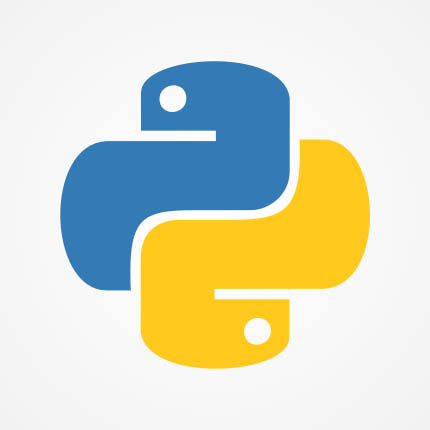
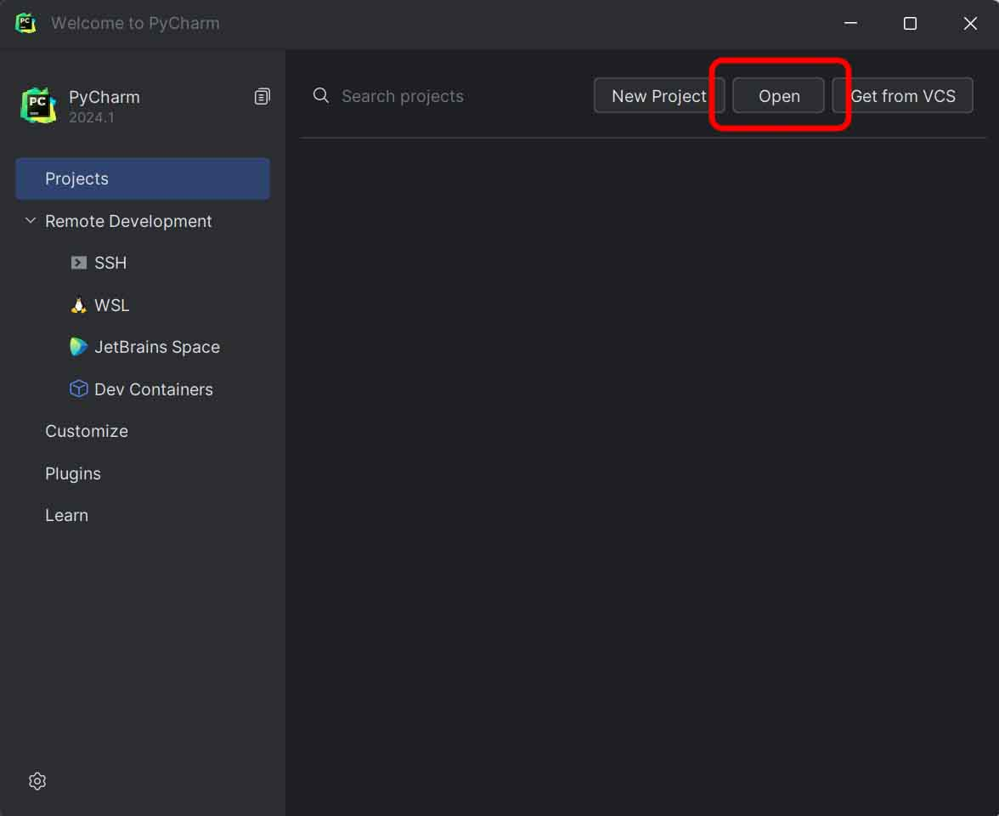
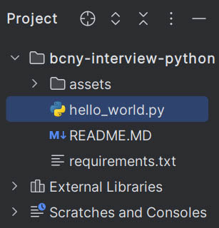
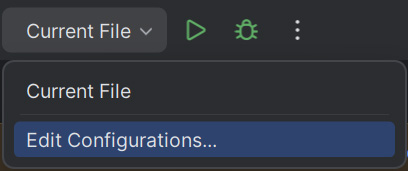
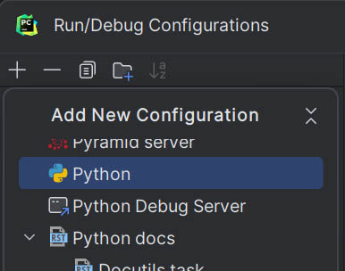
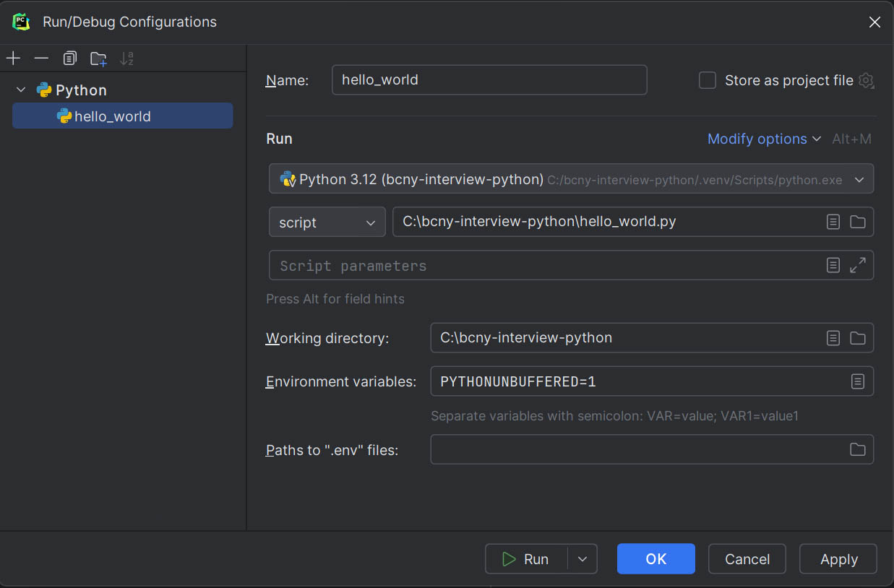
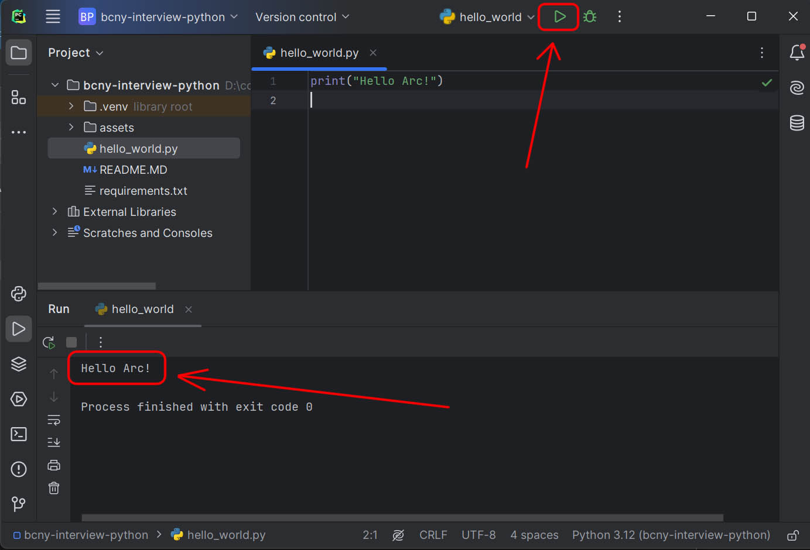

<h1>The Browser Company of New York</h1>

<table>
    <tr>
        <td style="width:80%;">
            <h2>Welcome to Python interview environment prep!</h2>
            Thank you for your interest. This is meant to prepare your environment prior to your coding exercise. 
        </td>
        <td style="width:10%">
            
        </td>
        <td style="width:10%">
            
        </td>
    </tr>
</table>

<h2>Requirements</h2>
<ul>
    <li>Latest Python 3 installed. Get it <a href="https://www.python.org/downloads/">here</a></li>
    <li>Download or clone this repo.</li>
</ul>

<h2>Optional</h2>
<ul>
    <li>Your choice of IDE.</li>
</ul>

<h2>Environment prep</h2>
<ol>
    <li>Launch command line terminal <code>win+r</code> then <code>cmd.exe</code> or launch Terminal in macOS.</li> 
    <li>Enter where this directory is located <code>cd path\to\dir\bcny-interview-python </code></li> 
    <li>
        Verify Python is installed 
        <b>Windows Example:</b>
        <pre><code>C:\bcny-interview-python> python --version 
Python 3.12.3</code></pre>
        * Note that your environment command may be <code>python3 --version</code> instead.
    </li> 
    <li>
        Create a virtual environment 
        <b>Windows Example:</b>
        <pre><code>C:\bcny-interview-python> python -m venv .venv</code></pre>
    </li> 
    <li>
        Enter the virtual environment 
        <b>Windows Example:</b>
        <pre><code>C:\bcny-interview-python> C:\bcny-interview-python\.venv\Scripts\activate</code> (venv) C:\bcny-interview-python></pre>
        If you've opened PowerShell instead of Windows command line, you can enter venv this way: 
        <b>Windows PowerShell Example:</b>
        <pre><code>C:\bcny-interview-python> .\.venv\Scripts\activate 
(venv) C:\bcny-interview-python></code></pre>
        <b>Linux / macOS Example:</b>
        <pre><code> ~/bcny-interview-python$ .venv/bin/activate 
(venv) bcny-interview-python$</code></pre>
    </li>
    <li>
        Verify Python can run 
        <b>Windows Example:</b>
        <pre><code>(venv) C:\bcny-interview-python> python hello_world.py 
Hello Arc!</code></pre>
        <b>Linux / macOS Example:</b>
        <pre><code>(venv) bcny-interview-python$ python hello_world.py 
Hello Arc!</code></pre>
    </li>
</ol>

<h2>PyCharm setup</h2>
<ol>
    <li>Download and install Pycharm <a href="https://www.jetbrains.com/pycharm/download">here</a></li> 
    <li>Launch PyCharm</li> 
    <li>Select <code>Open</code> </li>
    <li>Navigate to the downloaded <code>bcny-interview-python</code> folder and open it.</li> 
    <li>Click on the file <code>hello_world.py</code> in the Sidebar </li> 
    <li>Click on top corner run menu and select <code>Edit Configurations...</code> </li> 
    <li>Click the plus button <code>+</code> and choose <code>Python</code> </li> 
    <li>Enter <code>hello_world</code>as name, verify Run is on the Python venv that was created earlier, script is set to the <code>hello_world.py</code> path and working directory is set to the current directory. Press <code>OK</code>  
    <li>Click the green play button. Verify script is run and <code>Hello Arc!</code> is printed </li> 
</ol>

